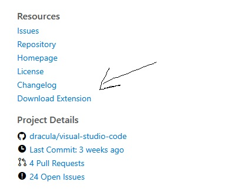

# tstudio-presets
A repository to store theme presets for theme studio


### Generate a new preset
```bash
$ python preset.py -theme <vsix file>
```
> NOTE: VSIX is the file format for vscode extensions.  
> eg. dracula-theme.theme-dracula-2.24.1.vsix

### How to get vsix file
